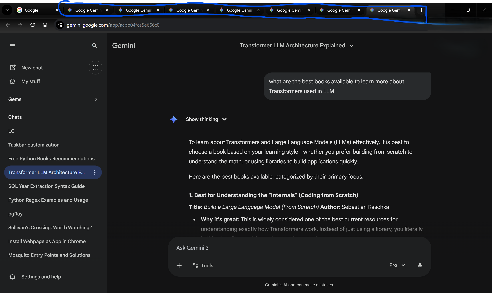

# Gemini Station 🚀

**Gemini Station** is a lightweight, local Chrome/Edge extension that fixes "New Chat" tab fatigue.

It solves the biggest annoyance with using Google Gemini for coding or deep work: **generic browser tabs.**

### The Problem
When you have 5+ tabs open, they all look like this:

### The Solution (Gemini Station)
This extension intelligently scrapes the conversation topic and renames your tabs instantly:

---

## ✨ Features

* **Auto-Rename Tabs:** Automatically updates the browser tab title to match the active conversation in the sidebar (e.g., "Python Regex Help" instead of "Gemini").
* **Context Menu Fix:** Adds a right-click **"Open Chat in New Tab"** option to the sidebar (fixing the native UI which fights against new tabs).
* **Zero-Config:** Just install it, and it works.

## 📦 Installation (Developer Mode)

Since this is a "Daily Driver" tool for developers, it's distributed as an **Unpacked Extension** (Manifest V3).

1.  **Download** or **Clone** this repository to a folder.
2.  Open your browser's extensions page:
    * **Chrome:** `chrome://extensions`
    * **Edge:** `edge://extensions`
3.  Toggle **Developer Mode** (top right corner).
4.  Click **Load Unpacked**.
5.  Select the folder containing the `manifest.json` file.

*Done! Open Gemini and refresh your tabs.*

---

## 🛠 How it Works

The logic is simple and transparent (see `content.js`):
1.  **Observer:** The script monitors the page for the active conversation ID.
2.  **Scraper:** It reads the conversation title from the sidebar DOM.
3.  **Syncer:** It updates `document.title` if it detects a generic title like "Gemini" or "New Chat."
4.  **Sanitizer:** It ignores status updates like "Updates" or "Help" to keep your tabs clean.

## 🔒 Privacy & Security

* **100% Local:** No data is sent to any server. No analytics. No tracking.
* **Minimal Permissions:** Only requests `storage` (for settings) and `contextMenus`.
* **Open Source:** You can audit the ~80 lines of code in `content.js` yourself.

## 💡 Pro Tip: The "App" Experience

If you want a native app-like experience without the bloat of Electron:

1.  Create a dedicated **Chrome/Edge Profile** named "Gemini".
2.  Install this extension in that profile.
3.  **Pin** that browser profile to your taskbar.

Now you have a dedicated "Gemini OS" that handles multiple tabs correctly!

## License
MIT License. Feel free to fork and improve the scraping logic!
