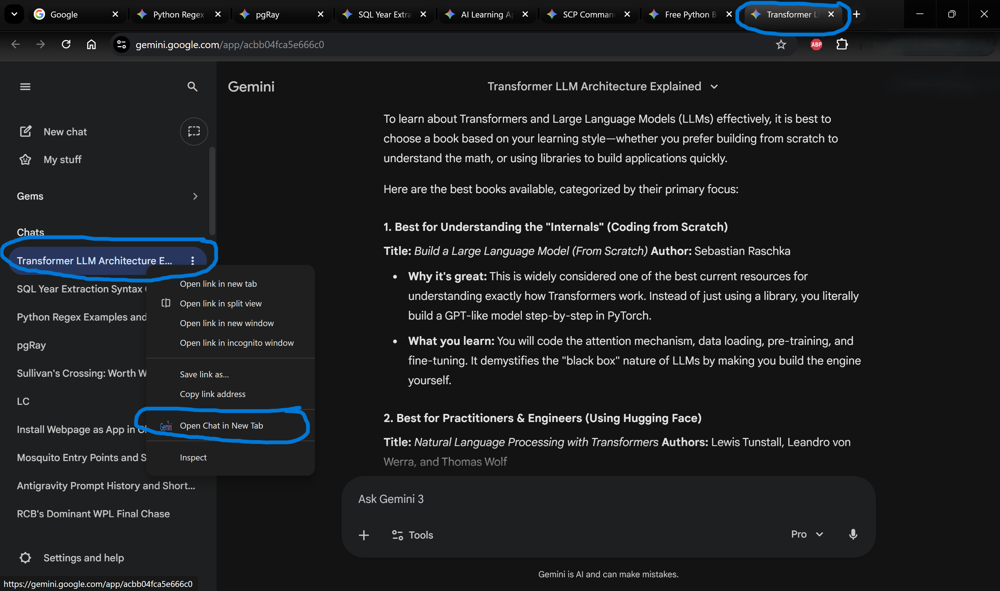

# Gemini Station 🚀

**Gemini Station** is a lightweight, "Native-Like" environment for Google Gemini, built on top of Microsoft Edge (or Chrome) profiles.

It solves the two biggest problems with using Gemini in a standard browser:
1.  **"New Chat" Fatigue:** Fixes generic tab titles so you can actually find your "Python Help" or "Dinner Recipe" tabs.
2.  **Context Switching:** Isolates your AI work from your daily browsing (email, social media) for deep work.

## Why not a Desktop App?
We tried building a custom wrapper (Electron/PyQt), but Google's security AI eventually blocks third-party login attempts. 

**Gemini Station** uses a dedicated Browser Profile, which means:
* ✅ **Zero Login Issues:** You are using a real, native browser.
* ✅ **Extensions Support:** Grammarly, 1Password, and other tools just work.
* ✅ **Zero Maintenance:** No code to update when Google changes their CSS.

## Included Tools

### 🧩 Gemini Title Fixer (Extension)
Gemini tabs usually just say "Gemini" or "New chat". This repo includes a custom unpacked extension that:
* Scrapes the sidebar for the *actual* conversation topic.
* Renames the browser tab instantly.
* Makes managing 10+ open chats possible.

## Setup Guide

### Step 1: The "Station" (Profile Setup)
1.  Open **Microsoft Edge** (or Chrome).
2.  Click your Profile Icon (top left) -> **Add Profile** -> **Add**.
3.  Name it **"Gemini Station"**.
4.  (Optional) Pick a dedicated icon (or the Gemini logo).
5.  **Pin it to Taskbar:** Right-click the new browser icon in your taskbar -> Pin to taskbar.

### Step 2: The "Intelligence" (Install Extension)
1.  Download or Clone this repository to a folder (e.g., `Documents/GeminiStation`).
2.  In your new Gemini Station browser window, go to:
    * **Edge:** `edge://extensions`
    * **Chrome:** `chrome://extensions`
3.  Toggle **Developer Mode** (usually a switch in the corner).
4.  Click **Load Unpacked**.
5.  Select the folder containing `manifest.json` from this repo.

### Step 3: The "App Feel" (Vertical Tabs)
For the best experience, we recommend:
1.  **Turn on Vertical Tabs** (Edge only): Right-click the tab bar -> "Turn on vertical tabs".
2.  **Hide the Address Bar** (Optional): Use "Focus Mode" if your browser supports it.

## How it Works
The included `content.js` script runs only on `gemini.google.com`. It intelligently looks at the active conversation sidebar and updates the HTML document title, which updates the tab name. It includes logic to ignore generic statuses like "Updates" or "Help".

## License
MIT License. Feel free to fork and improve the scraping logic!